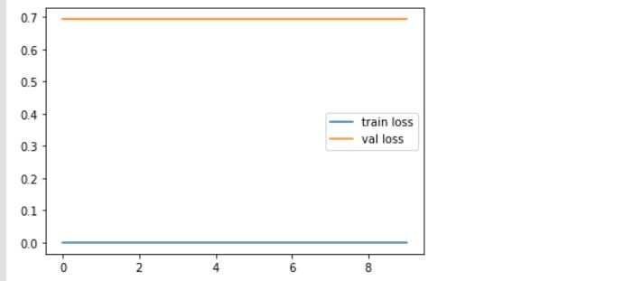
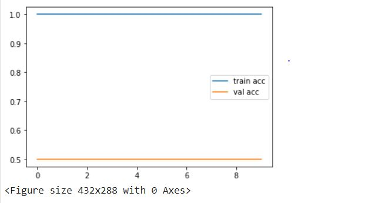

# Fish-Image-detection-and-classification
Here, I only did image classification and I will do the image detection further.

# Requirements
 You need to have a good internet connection. 
 You also need a basic knowledge of NLP and transfer learning models. 
 You need a google drive to mount the images in your code 
 
 # Using IDE
 GOOGLE COLAB 
 
 # Libraries requirements 
 
  1.absl-py==0.9.0 
  2.astunparse==1.6.3 
  3.attrs==19.3.0 
  4.backcall==0.1.0 
  5.bleach==3.1.5 
  6.cachetools==4.1.0 
  7.certifi==2020.4.5.1 
  8.chardet==3.0.4 
  9.click==7.1.2 
  10.colorama==0.4.3 
  11.cycler==0.10.0 
  12.decorator==4.4.2 
  13.defusedxml==0.6.0 
  14.entrypoints==0.3 
  15.Flask==1.1.2 
  16.Flask-Cors==3.0.8 
  17.gast==0.3.3 
  18.geojson==2.5.0 
  19.google-auth==1.15.0 
  20.google-auth-oauthlib==0.4.1 
  21.google-pasta==0.2.0 
  22.grpcio==1.29.0 
  23.h5py==2.10.0 
  24.idna==2.9 
  25.importlib-metadata==1.6.0 
  26.ipykernel==5.3.0 
  27.ipython==7.14.0 
  28.ipython-genutils==0.2.0 
  29.ipywidgets==7.5.1 
  30.itsdangerous==1.1.0 
  31.jedi==0.17.0 
  32.Jinja2==2.11.2 
  33.joblib==0.15.1 
  34.jsonify==0.5 
  35.jsonschema==3.2.0 
  36.jupyter==1.0.0 
  37.jupyter-client==6.1.3 
  38.jupyter-console==6.1.0 
  39.jupyter-core==4.6.3 
  40.Keras-Preprocessing==1.1.2 
  41.kiwisolver==1.2.0 
  42.lxml==4.5.1 
  43.Markdown==3.2.2 
  44.MarkupSafe==1.1.1 
  45.matplotlib==3.2.1 
  46.mistune==0.8.4 
  47.nbconvert==5.6.1 
  48.nbformat==5.0.6 
  49.notebook==6.0.3 
  50.numpy==1.18.4 
  51.oauthlib==3.1.0 
  52.opencv-python==4.2.0.34 
  53.opt-einsum==3.2.1 
  54.packaging==20.4 
  55.pandas==1.0.3 
  56.pandas-datareader==0.8.1 
  57.pandocfilters==1.4.2 
  58.parso==0.7.0 
  59.pexpect==4.8.0 
  60.pickleshare==0.7.5 
  61.Pillow==7.1.2 
  62.prometheus-client==0.7.1 
  63.prompt-toolkit==3.0.5 
  64.protobuf==3.8.0 
  65.ptyprocess==0.6.0 
  66.pyasn1==0.4.8 
  67.pyasn1-modules==0.2.8 
  68.Pygments==2.6.1 
  69.pyparsing==2.4.7 
  70.pyrsistent==0.16.0 
  71.PySocks==1.7.1 
  72.python-dateutil==2.8.1 
  73.pytz==2020.1 
  74.pywinpty==0.5.7 
  75.pyzmq==19.0.1 
  76.qtconsole==4.7.4 
  77.QtPy==1.9.0 
  78.requests==2.23.0 
  79.requests-oauthlib==1.3.0 
  80.rsa==4.0 
  81.scikit-learn==0.23.1 
  82.scipy==1.4.1 
  83.seaborn==0.10.1 
  84.Send2Trash==1.5.0 
  85.six==1.15.0 
  86.sklearn==0.0 
  87.tensorboard==2.2.1 
  89.tensorboard-plugin-wit==1.6.0.post3 
  90.tensorflow==2.2.0 
  91.tensorflow-estimator==2.2.0 
  92.termcolor==1.1.0 
  93.terminado==0.8.3 
  94.testpath==0.4.4 
  95.threadpoolctl==2.0.0 
  96.tornado==6.0.4 
  97.traitlets==4.3.3 
  98.urllib3==1.25.9 
  99.wcwidth==0.1.9 
  100.webencodings==0.5.1 
  101.Werkzeug==1.0.1 
  102.widgetsnbextension==3.5.1 
  103.wincertstore==0.2 
  104.wrapt==1.12.1 
  105.zipp==3.1.0 

# Dataset
I used two datasets and merged it to one another. 
1st dataset : https://swfscdata.nmfs.noaa.gov/labeled-fishes-in-the-wild/   
2nd dataset : https://www.sciencedirect.com/science/article/pii/S2352340919309205 (I take only catla folder from this dataset to the test set to check the train and test accuracy)   

# Loss Function
 I want to show the loss of train set and validation(test) set.
 
 
# Accuracy 
 I want to show the train and validation accuracy.
 
 
# Conclusion
The prediction is almost 100 percent. It is because the dataset used for the classification which is too small and the inception V3 model has a huge parameter.  
